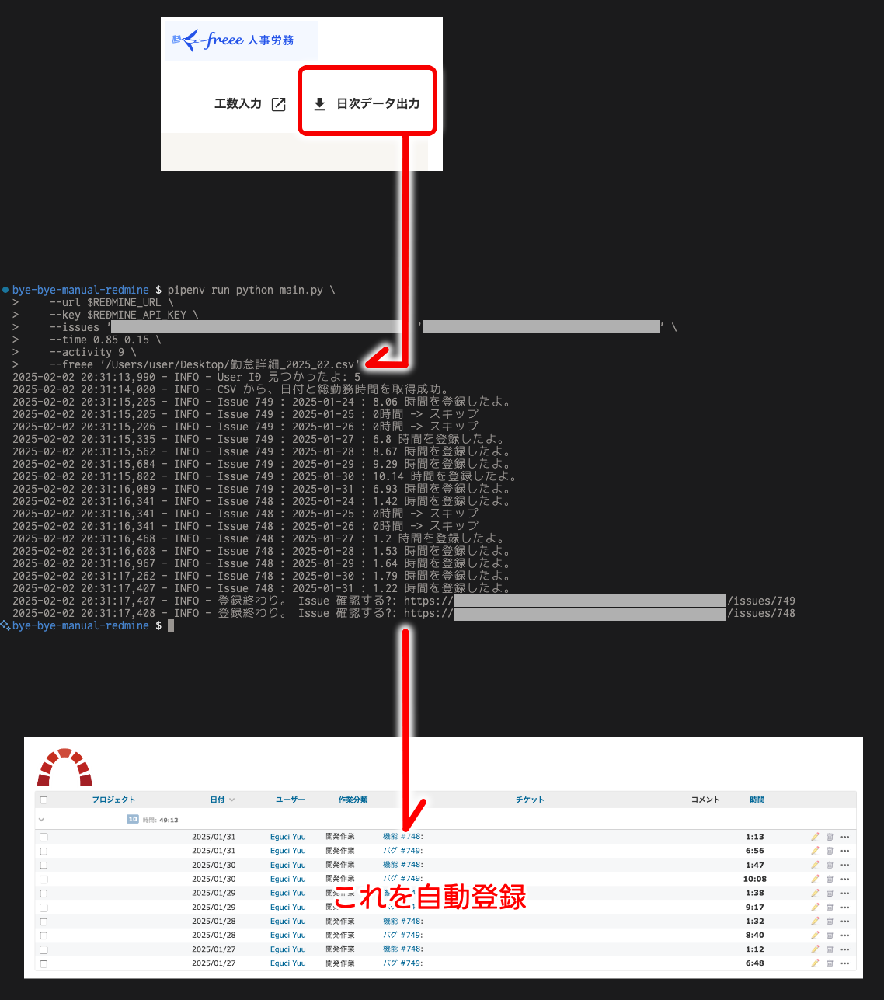

Bye Bye Manual Redmine!
===

手動入力なんてやってられないぜ!

Python 3.11 + pipenv + ruff + python-redmine + freee + lazy person.



## Usage

### 使う準備

```bash
# とりあえず使いやすくこれ↓を。ふつーにウェブの URL で OK。
export REDMINE_URL=https://your-redmine-url.com
# API key をここ↓で取得できる
open "$REDMINE_URL/my/account"
export REDMINE_API_KEY=your-api-key
```

```bash
# 最初だけ。
export PIPENV_VENV_IN_PROJECT=1; pipenv sync
```

### Freee の CSV を渡して、 Redmine の issue へ時間データを送り込む

```bash
# 使い方。
cd path/to/bye-bye-manual-redmine

# これで activity id 一覧が出るので、ひとつをコピーして --activity へ指定。
# NOTE: これは自動化できんかった……無念。
pipenv run python fetch_activities.py \
    --url $REDMINE_URL \
    --key $REDMINE_API_KEY

# これ実行。
# NOTE: Issue の存在が前提になっているので、事前に作っておくこと。
#       1年ぶんくらいの作業記録用の issue を作っておくといいかも。
pipenv run python main.py \
    --url $REDMINE_URL \
    --key $REDMINE_API_KEY \
    --issues 'Issue A' 'Issue B' \
    --time 0.85 0.15 \
    --activity 9 \
    --freee 'path/to/freee.csv'
```

### 出力例

```log
2025-02-02 20:12:16,384 - INFO - ステータスがアクティブであるアクティビティ一覧を取得したよ。こっから id をコピーして、 main.py に使ってね:
2025-02-02 20:12:16,384 - INFO - 8: 設計作業
2025-02-02 20:12:16,384 - INFO - 9: 開発作業
2025-02-02 20:12:16,384 - INFO - 10: 環境構築
```

### main.py は issue が前提になってるんだけどそもそも issue を作るのが面倒ってときのため

でもこれは今のところ使わないかも。
月をまたぐときの使い勝手が微妙。
でもせっかく作ったから取っとく。

```bash
# 使い方。
cd path/to/bye-bye-manual-redmine

# プロジェクトの id 一覧が出るので、これをコピーして今月ぶんの issue を作る。
pipenv run python fetch_projects.py \
    --url $REDMINE_URL \
    --key $REDMINE_API_KEY

pipenv run python register_monthly_issues.py \
    --url $REDMINE_URL \
    --key $REDMINE_API_KEY \
    --project 10 \
    --prefix 'Project B の作業' \
    --month '2025-01'
```

### 出力例

```log
2025-02-02 20:14:33,874 - INFO - User ID 見つかったよ: 5
2025-02-02 20:14:34,481 - INFO - 11: Project A
2025-02-02 20:14:34,481 - INFO - 23: Project B
2025-02-02 20:14:34,481 - INFO - 15: Project C
2025-02-02 20:14:34,483 - INFO - 10: Project D
```

```log
2025-02-02 20:18:56,361 - INFO - User ID 見つかったよ: 5
2025-02-02 20:18:56,376 - INFO - Issue の範囲: 2025-01-01 ～ 2025-01-31
2025-02-02 20:18:56,711 - INFO - 登録終わり。 Issue 確認する?: .../issues/747
```

## Memo

```bash
export PIPENV_VENV_IN_PROJECT=1; pipenv install --python 3.11
pipenv install python-redmine pandas
```

- Ruff
    - 本リポジトリでは、 dev dependencies には入れていなくて、 VSCode 拡張機能で使うようにしている。
    - ruff の設定 -> pyproject.toml
    - ruff 拡張機能の設定 -> .vscode/settings.json
